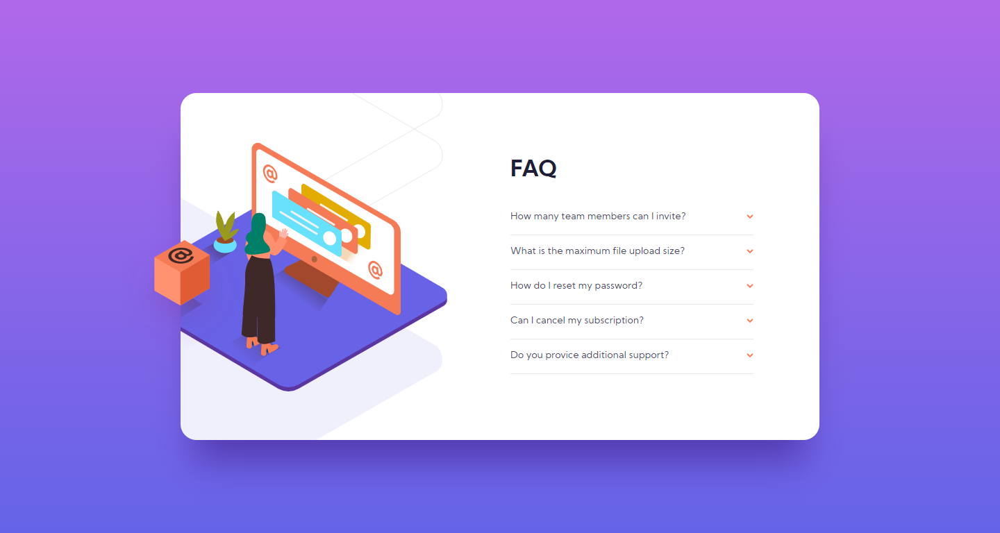
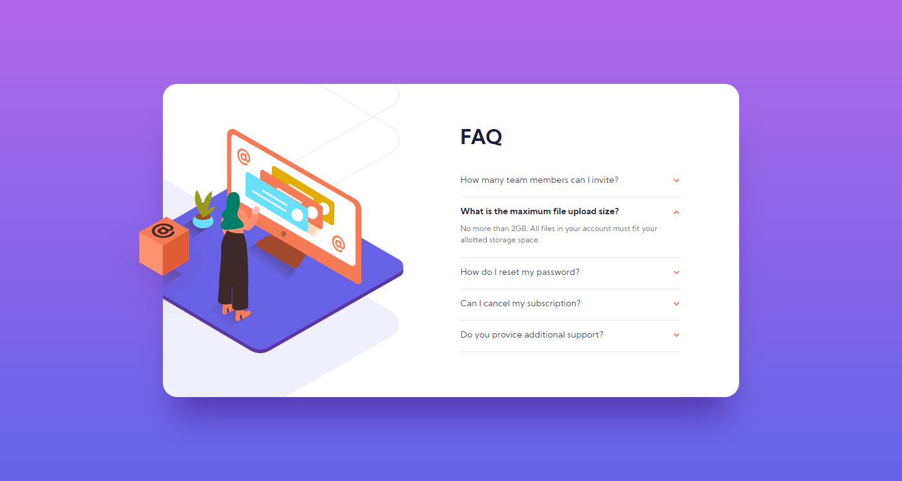
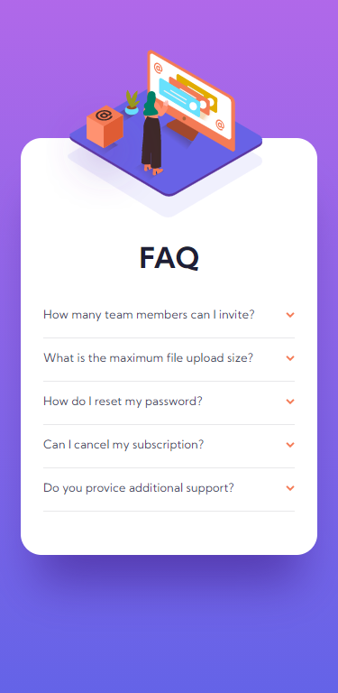

# Frontend Mentor - FAQ accordion card solution

This is a solution to the [FAQ accordion card challenge on Frontend Mentor](https://www.frontendmentor.io/challenges/faq-accordion-card-XlyjD0Oam). Frontend Mentor challenges help you improve your coding skills by building realistic projects.

## Table of contents

- [Overview](#overview)
  - [The challenge](#the-challenge)
  - [Screenshot](#screenshot)
  - [Links](#links)
- [My process](#my-process)
  - [Built with](#built-with)
  - [What I learned](#what-i-learned)
- [Author](#author)

## Overview

### The challenge

Users should be able to:

- View the optimal layout for the component depending on their device's screen size
- See hover states for all interactive elements on the page
- Hide/Show the answer to a question when the question is clicked

### Screenshot

### Links

- Solution URL: (https://www.frontendmentor.io/solutions/responsive-faq-accordion-card-with-smooth-animations-E4NZfw4IF)
- Live Site URL: (https://lm-faq-accordion-card.netlify.app/)

## My process

### Built with

- Semantic HTML5 markup
- CSS custom properties/vars
- Desktop-first workflow

### What I learned

Learnt/practiced a couple things. Probably my most favourite challenge so far due to the cool looking illustration, accordion components and the overall design really made me like this one.

Firstly, I learned how to put together an image where you have smaller svg's that make it up. I used  elements and a background css class element to put it all together. Then I played around with relative positioning and overflow to give it the effect of popping out the card.

Next, I tried to design as semantic and accessible as possible accordion component. Then, I added a smooth max-height animation + some hover/active states. Javascript was used to toggle classes and to make sure only one accordion is open at one time.

## Author

- Website - [Leon Michalak](https://www.leonmichalak.tech)
- Frontend Mentor - [@NinjaInShade](https://www.frontendmentor.io/profile/NinjaInShade)
- Instagram - [@lmdeveloper](https://www.instagram.com/lmdeveloper/)
